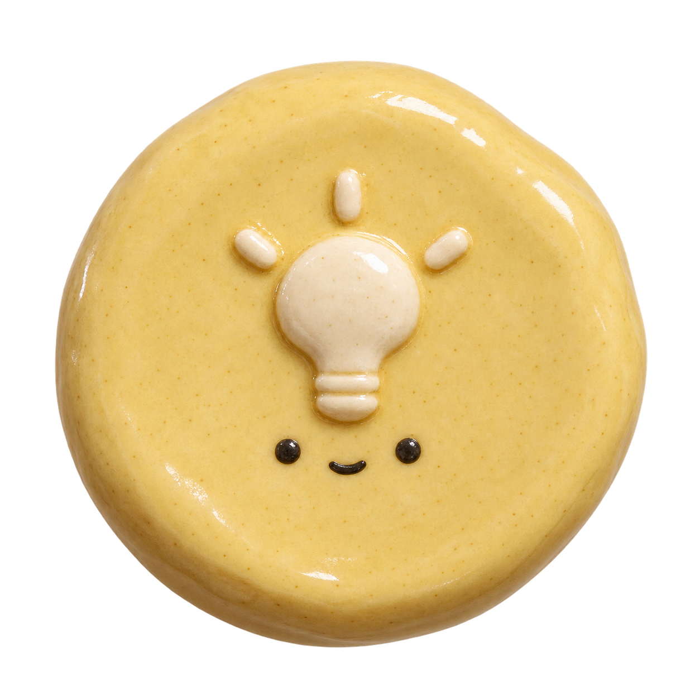
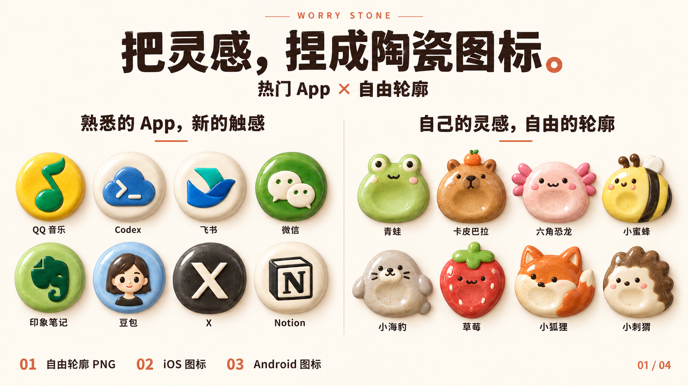
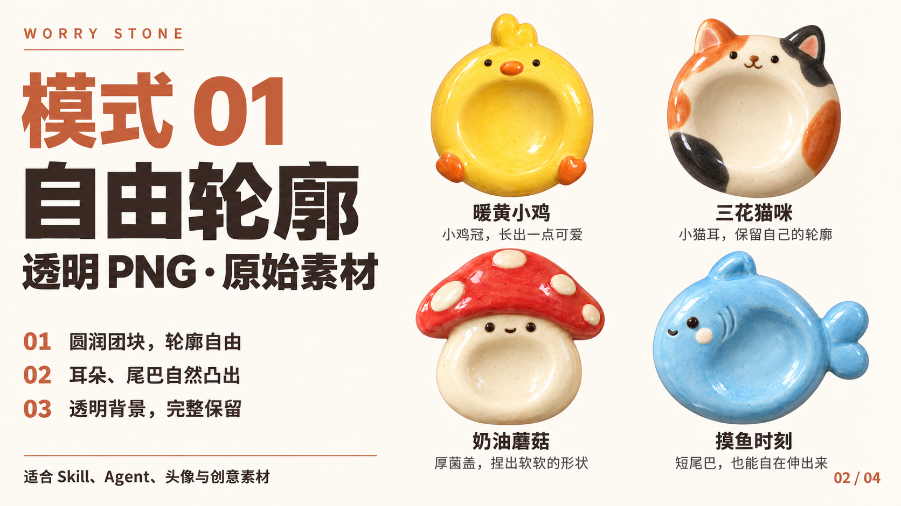
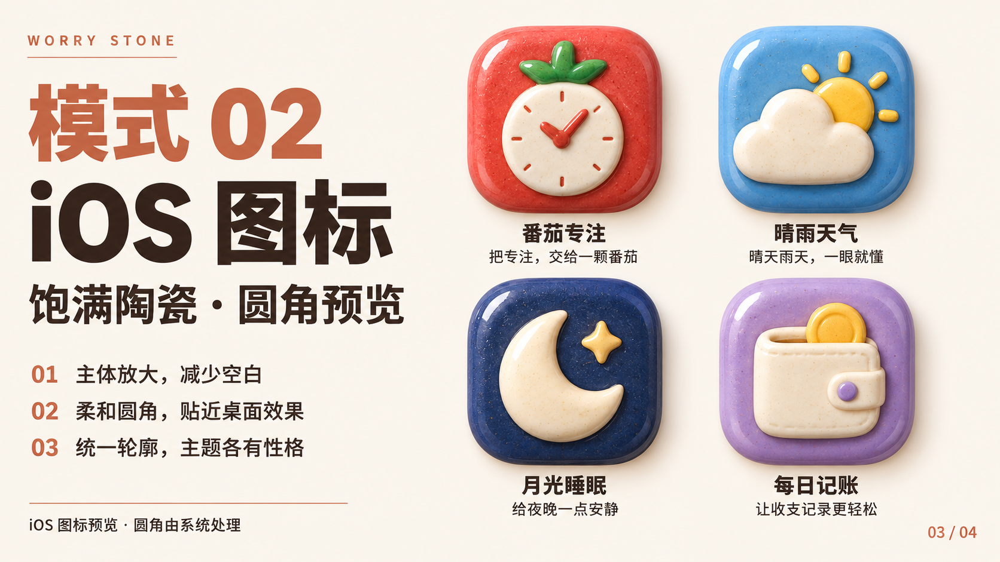
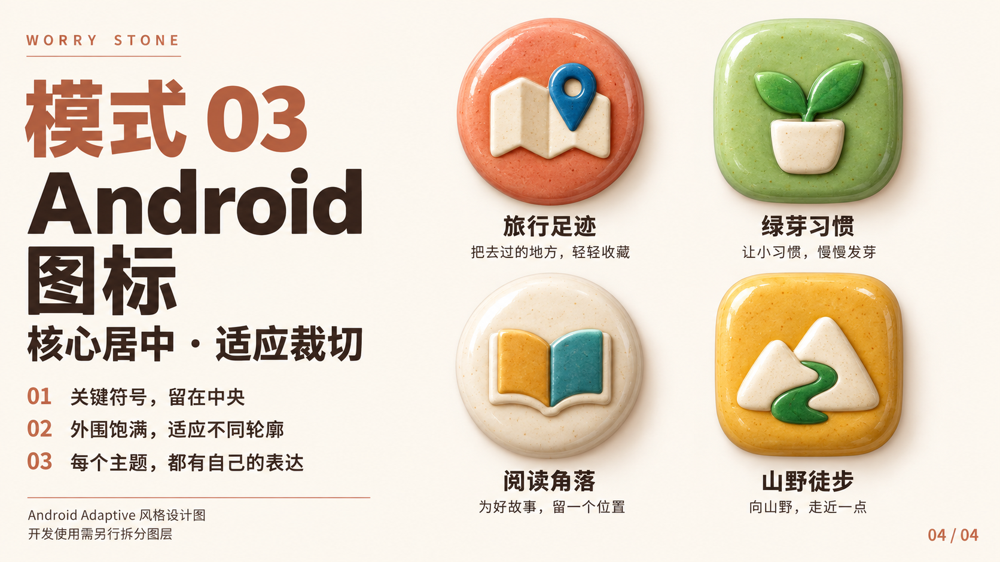

# Worry Stone App 图标 Lite

把一个主题变成一枚圆润、胖乎乎、有手作釉面触感的透明陶瓷图标。

> A lightweight AI skill for turning any theme into a hand-sculpted glazed ceramic icon with a transparent background.


[](https://youmind.com/skills/worry-stone-app-icon-design-sLSAbgfvWvafyD)

> 完整三模式 Pro 已在 YouMind 上线：**[打开「Worry Stone拟物化App图标设计」](https://youmind.com/skills/worry-stone-app-icon-design-sLSAbgfvWvafyD)**

<p align="center">
  
</p>

示例「灵感灯泡」：黄油黄陶瓷、奶白灯泡浅浮雕与柔和釉面，图片已验证包含真实透明通道。

适合项目标识、Skill、Agent、头像和网站图标素材。Lite 提供透明 PNG 模式。

## 开始使用

在支持 SKILL.md 的 AI 客户端中，将整个 worry-stone-app-icon-lite 文件夹放入该客户端的技能目录，再调用：

```text
使用 $worry-stone-app-icon-lite，为「暖黄小鸡」生成一枚自由轮廓的透明陶瓷素材。
```

也可以把 [SKILL.md](SKILL.md) 中 YAML 元数据之后的完整正文粘贴到支持生图的对话，再附上主题。仅支持文字的环境会返回生图提示词。

```text
主题：相机
颜色：柔和灰蓝
不要五官
```

只需主题，配色与表情可选。默认一张 1:1、主体完整居中的透明图标。1:1 指画布，主体可以是蛋形、豆形或带自然凸起的自由轮廓。

## 风格与输出

圆润紧凑的手捏陶瓷体量，允许蛋形、豆形、胖水滴形等自由轮廓。猫耳、鸡冠、厚菌盖和短尾可以自然凸出；五官克制，釉色柔和，保留自然的小面积高光。可以规整，也可以异形，不强制套圆盘。

PNG 是位图。实际透明通道取决于运行环境的生图与导出能力；技能会要求透明输出，并在具备文件检查能力时验证。

[下载灵感灯泡示例](examples/inspiration.png)。这枚示例采用规整轮廓，技能也支持带猫耳、鸡冠、菌盖或短尾的自由轮廓素材。

## 在 YouMind 使用 Pro

想生成更完整的 App 图标设计，可以使用 YouMind Pro：包含自由轮廓透明素材、iOS 图标和 Android Adaptive 风格设计三种模式，并提供更完整的主题转译与构图纠偏。

[在线使用 Worry Stone 拟物化 App 图标设计](https://youmind.com/skills/worry-stone-app-icon-design-sLSAbgfvWvafyD)

在手机上也可以复制下面这段文字，再打开 YouMind App：

```text
复制这段文字，然后打开 YouMind App，即可查看「Worry Stone拟物化App图标设计」
口令：YMS-sLSAbgfvWvafyD
```

## Pro 效果展示

展示图用于说明三种模式的视觉效果；其中模式 1 的目标输出是独立透明 PNG，展示页本身带有排版和象牙白背景。



| 模式 1 · 自由轮廓透明素材 | 模式 2 · iOS 图标 |
| --- | --- |
|  |  |



| 版本 | 范围 |
| --- | --- |
| Lite（本仓库） | 透明 PNG 图标、基础风格与结果检查 |
| Pro | 完整主题转译、透明 / iOS / Android 三模式、平台构图与定向纠偏 |

Lite 可独立使用。Pro 的完整指令通过 YouMind 提供：[立即前往](https://youmind.com/skills/worry-stone-app-icon-design-sLSAbgfvWvafyD)。

iOS 和 Android 开发需要的图层、资源配置与平台验证，不属于本 Lite 素材模式的交付范围。

## 关注公众号

如果你也在研究 AI 工具、Agent、Skill 和个人生产力，欢迎在微信「搜一搜」中搜索 **Pamela的AI笔记**，或扫描下方二维码关注。后续会继续分享这个 Skill 的使用案例和更多 AI 创作实践。

<p align="center">
  
</p>
